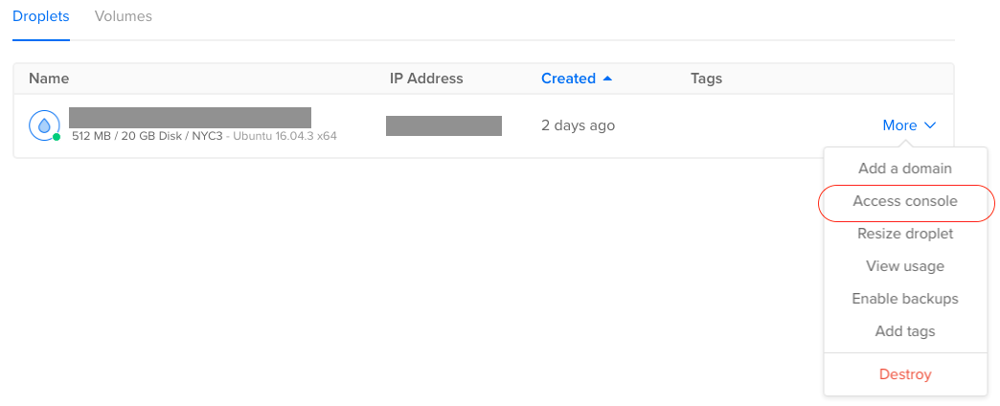

# Overview

This is a tutorial on setting up a server on DigitalOcean, a cloud computing platform. We will walk through whole process from creating an account to setting up a server instance and connecting to it. The process should be similar for any cloud computing services. Once you set up your server on any platform of your choice the remaining deploying steps should be identical. Here is a tutorial that may serve as a general guide on deploying your Python app onto any hosting platforms: [How to Deploy Python App Using uWSGI and Nginx](https://github.com/tecladocode/rest-apis-flask-python/blob/master/guides/How%20To%20Deploy%20Python%20App%20Using%20uWSGI%20And%20Nginx.pdf).

DigitalOcean is a cloud infrastructure provider focused on simplifying web infrastructure for software developers. It allows you to rent servers with different performance at different cost. For more detailed information, you may refer to the official website help page [here](https://www.digitalocean.com/help/).

## Creating an account

You can sign up to DigitalOcean using our affiliate link. Doing so gives you a starting credit of $100 to spend in 60 days. Click this link to create your account and get the $100: [https://m.do.co/c/d54c088544ed](https://m.do.co/c/d54c088544ed). If the link doesn't work, paste it into your browser.

After clicking the link, you should see a page like the above. Create your account at the left-bottom corner and you'll receive the $100 automatically. Beware that you'll be asked to provide payment info when creating the account, since all services (which you'll choose below) in DigitalOcean will be charged after your credit runs out.

## Creating a Droplet

A server instance in DigitalOcean is called a `Droplet`. It's just a name that may vary in different platforms, for example, `Dyno` for `Heroku` and `EC2` for `AWS` (Amazon Web Service). Below are the steps to create a `Droplet`.

### Choosing an image

To create a `Droplet`, we must first specify an image, that is, choosing what Operating System you want for the server. We recommend to use a Ubuntu LTS (Long Term Support) distribution. For more info on Ubuntu life time, please refer to the [official Ubuntu end of life page here](https://www.ubuntu.com/info/release-end-of-life). In our example, we'll use `Ubuntu 16.04.* x64`, which is an LTS distribution.

### Choosing a size

Next, we need to choose the specs for our server. In this tutorial, we'll be using the most basic tier of a Standard `Droplet`, which offers a single CPU with 512MB RAM, 20GB SSD and 1000 GB transfer at $5 per month. Generally, it's more than enough for running personal applications. You may also run several services in a single Droplet.

### Choosing a datacenter region

Generally, choosing a region that's _closest to your users_ will make your service deliver faster. If your users are primarily in the United States, you could choose a United States-based Droplet.

### Other configurations

In our example, we do not need to add any other services such as block storage or private network. So we will ignore these settings to keep our setup simple and cheap. You may choose to use `SSH` key or you can just leave it unchecked and a password will be generated for you. If you choose to use SSH key, then each time you want to login to the server, you will need to provide the key. Since you have to have access to the SSH key whenever you log in, it can be more secure or more troublesome depends on scenarios. At last, you may change the name of your `Droplet` to something you like and then click `Create` to create and launch your `Droplet`.

## Connecting to our droplet

Once you've created your `Droplet`, you will receive an e-mail containing your login (`root`) and initial password for it. Now click the "Access Console" option in the dropdown menu associated with your `Droplet` as shown in above image.

## Change your password

Now you will be shown a console connected to your `Droplet`. Use the login `root` and the password received in your email to login. Then you will be ask to provide your password again and change it to a new password. Notice that all password field will not show any modification when you are typing. There is nothing wrong with your console, it's just a `UNIX` security feature. After changing your password, you are now logged in as the root user on your server.

If you have successfully followed the tutorial so far, then you have finished all the setting-ups that are specific to DigitalOcean. The following sections can serve as a standalone tutorial and can be applied to deployment onto any other platforms as well.

## Deploying application onto our server

After setting up our server (Droplet), the next thing we may want to do is to deploy our application onto the server. We will not, however, cover the process in this tutorial. Instead we recommend you to read this separate tutorial: [How to Deploy Python App Using uWSGI and Nginx](https://github.com/tecladocode/rest-apis-flask-python/blob/master/guides/How%20To%20Deploy%20Python%20App%20Using%20uWSGI%20And%20Nginx.pdf). We organize contents in such way because deployment is an independent process and should be similar on any platforms, not specific to DigitalOcean. So if you are curious, please check it out.

Thanks for reading!
